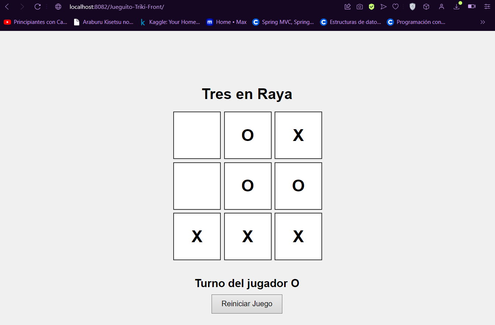
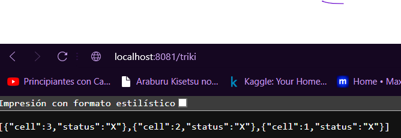

# Tres en Raya (Triki)

## Descripción

Tres en Raya es una aplicación web que permite jugar al clásico juego de Triki (Tres en Raya) en línea. La aplicación está construida con Spring Boot y un front manejado con JavaScript

## Tecnologías

- **Spring Boot**: Framework para construir aplicaciones Java.
- **Java**: Lenguaje de programación utilizado.
- **JavaScript**: Lenguaje para manejar el lado del cliente.

## Requisitos

- Java 11 o superior
- Maven o Gradle
- Un navegador web

## Configuración del Proyecto

1. **Clonar el repositorio:**

   ```bash
   git clone https://github.com/tu_usuario/tres-en-raya.git
   cd tres-en-raya
2. **Construir el proyecto:**

Si usas Maven:
   ```
  mvn clean install
```
O si usas Gradle:
```
  ./gradlew build
```




